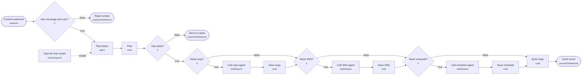

# auto3 · 마케팅 콘텐츠 제작

- 파일: `/home/playdata/aio-01d4-stu/Last3Mon/68/my-work/auto3/content/a3-content.json`
- 마케팅 콘텐츠 제작 · 노드 19 (+ 메모 2) · 연결 21 (main 20 · model 1)

```mermaid
flowchart LR
  n0(["Content webhook<br/><small>webhook</small>"])
  n1{"Has message and user?<br/><small>if</small>"}
  n2(["Reject empty<br/><small>respondToWebhook</small>"])
  n3["Plan tasks<br/><small>agent</small>"]
  n4["OpenAI chat model<br/><small>lmChatOpenAi</small>"]
  n5["Plan<br/><small>code</small>"]
  n6{"Has tasks?<br/><small>if</small>"}
  n7(["Send no tasks<br/><small>respondToWebhook</small>"])
  n8{"Need copy?<br/><small>if</small>"}
  n9["Call copy agent<br/><small>httpRequest</small>"]
  n10["Save copy<br/><small>code</small>"]
  n11{"Need SNS?<br/><small>if</small>"}
  n12["Call SNS agent<br/><small>httpRequest</small>"]
  n13["Save SNS<br/><small>code</small>"]
  n14{"Need schedule?<br/><small>if</small>"}
  n15["Call schedule agent<br/><small>httpRequest</small>"]
  n16["Save schedule<br/><small>code</small>"]
  n17["Build reply<br/><small>code</small>"]
  n18(["Send result<br/><small>respondToWebhook</small>"])
  n0 --> n1
  n1 -->|true| n3
  n1 -->|false| n2
  n3 --> n5
  n5 --> n6
  n6 -->|true| n8
  n6 -->|false| n7
  n8 -->|true| n9
  n8 -->|false| n11
  n9 --> n10
  n10 --> n11
  n11 -->|true| n12
  n11 -->|false| n14
  n12 --> n13
  n13 --> n14
  n14 -->|true| n15
  n14 -->|false| n17
  n15 --> n16
  n16 --> n17
  n17 --> n18
  n4 -. model .-> n3
```
