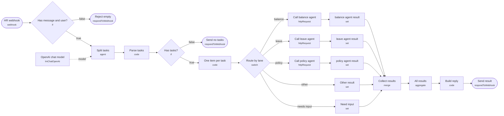

# auto3 · 인사(HR) 문의 창구

- 파일: `/home/playdata/aio-01d4-stu/Last3Mon/68/my-work/auto3/hr/a3-hr.json`
- 인사(HR) 문의 창구 · 노드 22 (+ 메모 2) · 연결 25 (main 24 · model 1)

```mermaid
flowchart LR
  n0(["HR webhook<br/><small>webhook</small>"])
  n1{"Has message and user?<br/><small>if</small>"}
  n2(["Reject empty<br/><small>respondToWebhook</small>"])
  n3["Split tasks<br/><small>agent</small>"]
  n4["OpenAI chat model<br/><small>lmChatOpenAi</small>"]
  n5["Parse tasks<br/><small>code</small>"]
  n6{"Has tasks?<br/><small>if</small>"}
  n7(["Send no tasks<br/><small>respondToWebhook</small>"])
  n8["One item per task<br/><small>code</small>"]
  n9{"Route by lane<br/><small>switch</small>"}
  n10["Call balance agent<br/><small>httpRequest</small>"]
  n11["balance agent result<br/><small>set</small>"]
  n12["Call leave agent<br/><small>httpRequest</small>"]
  n13["leave agent result<br/><small>set</small>"]
  n14["Call policy agent<br/><small>httpRequest</small>"]
  n15["policy agent result<br/><small>set</small>"]
  n16["Other result<br/><small>set</small>"]
  n17["Need input<br/><small>set</small>"]
  n18["Collect results<br/><small>merge</small>"]
  n19["All results<br/><small>aggregate</small>"]
  n20["Build reply<br/><small>code</small>"]
  n21(["Send result<br/><small>respondToWebhook</small>"])
  n0 --> n1
  n1 -->|true| n3
  n1 -->|false| n2
  n3 --> n5
  n5 --> n6
  n6 -->|true| n8
  n6 -->|false| n7
  n8 --> n9
  n4 -. model .-> n3
  n9 -->|balance| n10
  n9 -->|leave| n12
  n9 -->|policy| n14
  n9 -->|other| n16
  n9 -->|needs input| n17
  n10 --> n11
  n11 --> n18
  n12 --> n13
  n13 --> n18
  n14 --> n15
  n15 --> n18
  n16 --> n18
  n17 --> n18
  n18 --> n19
  n19 --> n20
  n20 --> n21
```
