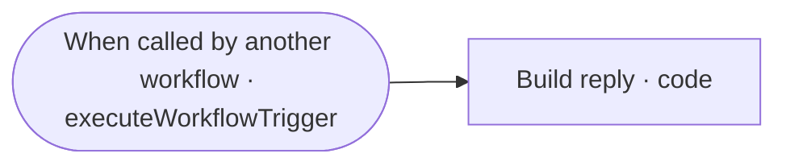

# 70-11 · 🧩 모듈 · 답장 만들기 v2 (modBuildReply02)

- 파일: `../rk-build-reply-v2.json`
- 노드 3 · 연결 1 (메모 1개는 그림에서 뺌)

```mermaid
flowchart LR
  n1(["When called by another workflow · executeWorkflowTrigger"])
  n2["Build reply · code"]
  n1 --> n2
```
