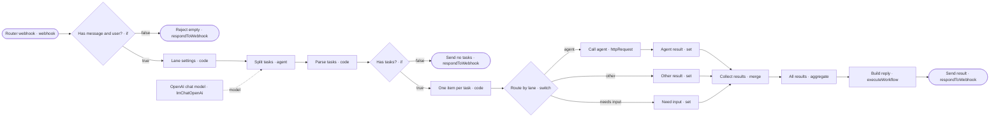

# 70-7 · 🧭 router-kit · HR 라우터 (원본)

- 파일: `../rk-hr.json`
- 노드 21 · 연결 20 (메모 2개는 그림에서 뺌)

```mermaid
flowchart LR
  n1(["Router webhook · webhook"])
  n2{"Has message and user? · if"}
  n3(["Reject empty · respondToWebhook"])
  n4["Lane settings · code"]
  n5["Split tasks · agent"]
  n6["OpenAI chat model · lmChatOpenAi"]
  n7["Parse tasks · code"]
  n8{"Has tasks? · if"}
  n9(["Send no tasks · respondToWebhook"])
  n10["One item per task · code"]
  n11{"Route by lane · switch"}
  n12["Call agent · httpRequest"]
  n13["Agent result · set"]
  n14["Other result · set"]
  n15["Need input · set"]
  n16["Collect results · merge"]
  n17["All results · aggregate"]
  n18["Build reply · executeWorkflow"]
  n19(["Send result · respondToWebhook"])
  n1 --> n2
  n4 --> n5
  n5 --> n7
  n7 --> n8
  n10 --> n11
  n12 --> n13
  n16 --> n17
  n17 --> n18
  n18 --> n19
  n2 -->|true| n4
  n2 -->|false| n3
  n8 -->|true| n10
  n8 -->|false| n9
  n11 -->|agent| n12
  n11 -->|other| n14
  n11 -->|needs input| n15
  n13 --> n16
  n14 --> n16
  n15 --> n16
  n6 -. model .-> n5
```
